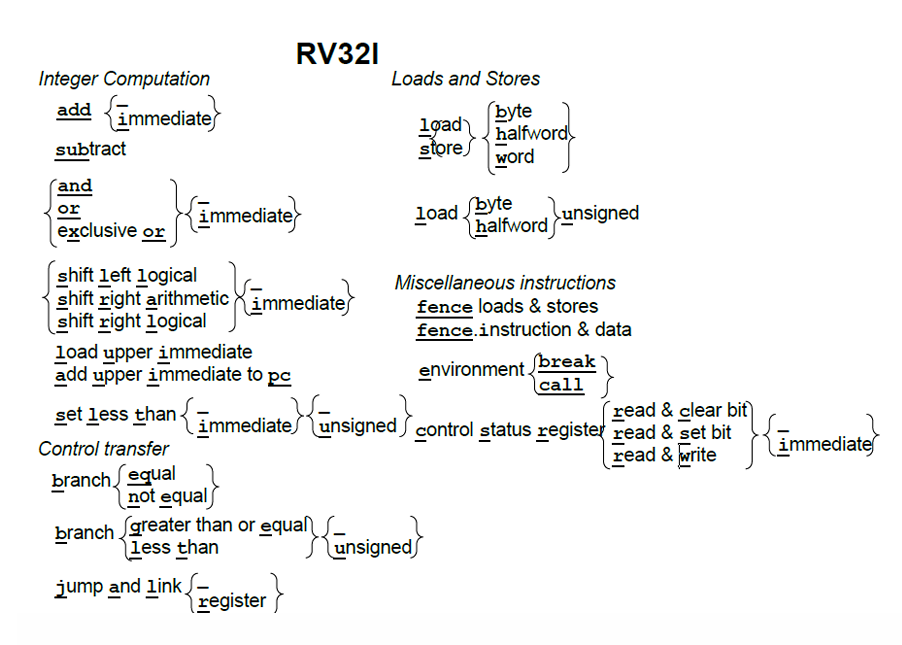
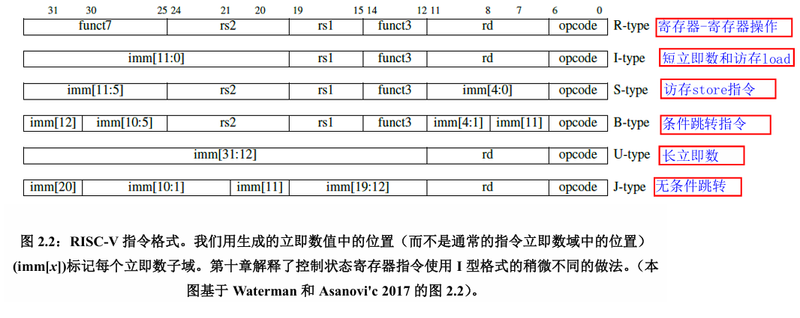
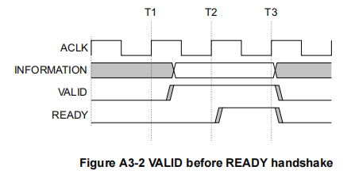
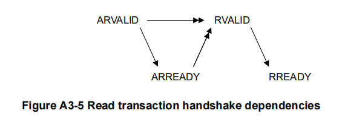
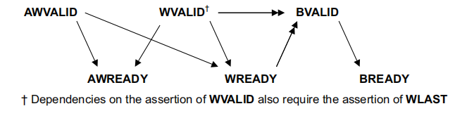
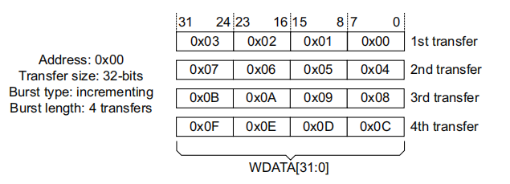
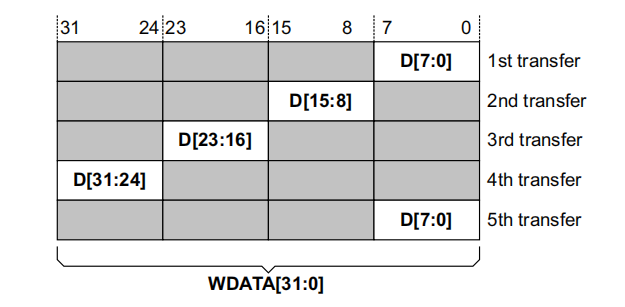
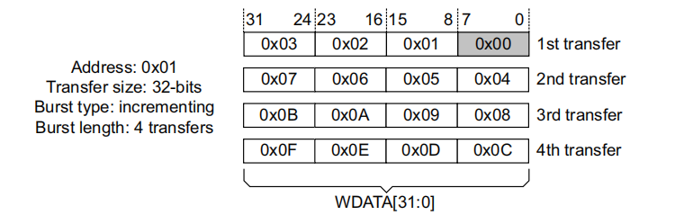

---
title: ysyx 
author: JYC
description: Record about significant knowledge and difficulties met in ysyx study
date: 2024-10-21 18:43:30 
categories: [Study, Digital Circuit]
tags: [verilog, digit]     # TAG names should always be lowercase
math: true
comments: true
--- 

> Make a little bit progress every day


## 有限状态机(FSM)

- Moore状态机  
  输出只与当前状态有关
- Mealy状态机  
  输出与当前状态和输入有关


## GDB

- `r(run)` - 运行
- `b + 行号` - 在一个行打断点
- `b 源文件：行号` - 在源文件某行加上断点
- `info b` - 查看断点信息
- `d(delete) + 当前要删除断点的编号` - 删除一个断点
- `n(next)` - 逐过程
- `s(step)` - 逐语句
- `p 变量名` - 打印变量值
- `c(continue)` - 继续直到下一个断点

## ysyx源码理解


- 取指  

```C++
  s->isa.inst.val = inst_fetch(&s->snpc, 4); // 
```

- 译指执行  

```
  decode_exec(s)
```

- 更新PC  

```
  cpu.pc= s->dnpc //跳转指令 
```

- 一些关键函数的理解  
  
```
//拓展符号位 
#define SEXT(x, len) 
({ 
  struct { int64_t n : len; }//构建一个位宽为len的_x.n
  __x = { .n = x }; 
  (uint64_t)__x.n; //进行符号位扩展
 })

```

## RISC-V指令集  
RISC-V不同寻常之处除了开源之外，与其他ISA不同之处是，它是模块化的，它的核心是一个名为RV32I的基础ISA，运行一个完整的软件栈。

上图为RV32I的基础指令，根据指令功能的不同其又分为不同的指令格式

根据对应的指令格式可以对于指令进行译码

## Verilator中DPI-C的使用

> Manual is always right

[Verilator官方手册](https://verilator.org/guide/latest/)   

### Direct Programming Interface(DPI)解读

verilator 支持SV中使用一种接口引入C语言的函数进行使用，其对应的接口称之为DPI。  
  
首先在main.cpp文件中可以创建需要引入SV的函数  
```
#include "svdpi.h"
#include "Vour__Dpi.h"
int add(int a, int b) { return a+b; }
```

然后可以在SV文件中调用
```
import "DPI-C" function int add (input int a, input int b);

initial begin
   $display("%x + %x = %x", 1, 2, add(1,2));
endtask
```
  
进过verilator编译，引入的C语言函数，会被编译成一种函数拓展

```
extern int add(int a, int b);
```

## Makefile语法
- basename  
名称：取前缀函数  
语法：$(basename < names... >)  
作用：从文件名序列中< names >中取出各个文件名的前缀部分。  
返回：文件名序列中< names >的前缀序列  
示例：  

```shell  
SRC := src/main.c src/hello.c
OBJ := $(basename $(SRC)) 
all:
	@echo "$(OBJ)"
```  
执行结果:

```  
src/main src/hello
```
- suffix  
名称：取后缀函数  
语法：$(suffix < names... >)  
功能：从文件名序列 < names > 中取出各个文件名的后缀。  
返回：返回文件名序列 < names > 的后缀序列，如果文件没有后缀，则返回空字串。  

```shell  
SRC := src/main.c src/hello.c
OBJ := $(suffix $(SRC)) 
all:
	@echo "$(OBJ)"
```

执行结果：

```
.c .c
```
- addsuffix  

名称：加后缀函数——addsuffix。  
语法：$(addsuffix < suffix >,< names... >)  
功能：把后缀 < suffix > 加到 < names > 中的每个单词后面。  
返回：返回加过后缀的文件名序列。\
示例：
```shell
SRC := src/main src/hello
OBJ := $(addsuffix ".c", $(SRC)) 
all:
	@echo "$(OBJ)
```
执行结果: 
```shell
src/main.c src/hello.c 
```
- flavor  
名称：判断变量类型函数  
语法：$(flavor var)  
功能：返回一个变量的状态  
返回：
  1. 变量不存在，返回'undefined'字符串
  2. 用于循环了的变量，返回'recursive'
  3. 不是循环变量，返回'simple'  

  示例：  
```shell
 foo:= A  
 boo = B
 C = $(flavor foo)
 D = $(flavor boo)
 all:
     @echo $(C)
     @echo $(D)
``` 

执行结果：
```shell
simple
recursive 
```

- join  
名称：组合函数   \
语法：$(join < names...>, < names...>) \
功能：将第一个< names...>与第二个< names...>组合 \
返回：组合的字符串 \
示例：

```shell
@echo $(join a b c, .a .a .a)
```
执行结果：
```
a.a b.a c.a
```

## 流水线CPU设计

简单的CPU处理器分为五个阶段，取指(IF)，译码(ID)，执行(EX)，访存(LS)，写回(WB)，五个阶段，流水线处理器顾名思义，将一个指令
分为多个阶段完成，流水化的传递信息。\
<!-- markdownlint-capture -->
<!-- markdownlint-disable -->
> 为什么要设计流水线式的CPU?  
{: .prompt-info }
<!-- markdownlint-restore -->

在不降低IPC(Instruction per cycle)的情况下，尽可能提高处理器的运行频率(由最长延时决定，多周期可以缩减关键路径)


### 数据冒险和控制冒险 
数据冒险和控制冒险是流水线式CPU普遍存在的问题
#### 数据冒险
数据冒险是由于写入寄存器和读取寄存器的时间冲突引起的。其通常发生在**下一条指令的源寄存器与上一条指令目的寄存器相同**情况下，因为此时上一条指令还未到写回阶段，但本条指令已经到了执行阶段，源寄存器的值还未得到及时更新则发生了冒险。  

下面是两个很好的例子
```shell
1. 
addi t0,t1,1 
and t2,t0,t1
2. 
lw s0,12(sp)
addi t0,s0,1
```

**该如何解决数据冒险？**
- 数据前递 (Data Forward)
- 流水线停滞 (Pipeline Stop)

示例1中，当第二条指令译码结束时，此时第一条指令刚刚执行结束，可以通过将EXU的数据进行前递即可解决问题。\
示例2中，当第二条指令译码结束时，此时第一条刚到执行结束，s0的值还未取到(因为这是一条访存指令，s0的值在LS阶段取到)，所以我们不得不停滞流水线，然后再配合数据前递

#### 控制冒险

控制冒险通常发生在branch指令和jump指令中，通常我们在IF阶段要对指令进行预取指，其地址通常为pc+4，但是一旦发生跳转，pc的值就会发生改变，预取指的指令则会发生错误，此时就发生了控制冒险。

**该如何解决控制冒险？**

- 冲刷流水线 (将控制信号变为0)
- 分支预测 (还未学会^^)


## AXI4 总线

> 选择一些困难的点讲解，细节部分请阅读AXI4官方手册    


### 性能
  - 适用于高带宽、低延迟的设计
  - 适用于具有较高初始访问延迟的内存控制器
### 特性
  - 独立的地址和数据传输阶段
  - 通过strobe实现非对齐访问
  - 独立的地址和数据通道  
  - 能够同时分发多个地址
  - 支持乱序传输事件  
  - 支持突发传输
### 信号描述
- 写地址通道
  - awid   用于区分多个地址写入时的通道,同id的数据从相同id的通道返回
  - awaddr 写入的地址
  - awlen  一次burst传输的次数 transfer number = awlen + 1 
  - awsize 一次传输的字节数 bytes = 2^(awsize)
  - awburst 突发模式选择 
  - awvalid 握手信号
  - awready 握手信号
- 写数据通道
  - wid 与 awid 一致
  - wstrb 用来选择有效的写入字节
  - wlast 标志最后一次写入
  - wvalid 握手信号
  - wready 握手信号
### 握手协议(HandShake Process)
只有当valid和ready同时有效时，传输才成功,下图是具体的波形图。
   

为避免死锁(一直握手不成功)，Manual中给出了通道间的依赖关系,图中**单箭头表示依赖关系可以不满足，双箭头表示必须满足**，我对此进行了总结:   
  - valid 和 ready 相互独立，不必ready等valid置1时才置1，是否置1只取决于主从设备的状态
  - 对于读事件，地址通道的握手事件一定要先于数据通道
  - 对于写事件，地址通道和数据通道的握手事件可以相互独立，但是回应事件一定要在数据通道握手之后
  
  
  
### 传输细节以及对于非对齐访问的处理
**关键信号**  
  - WSTRB[n:0] - 用来指示哪个字节(8个bit位)有效,每一位对应一个字节即 WSTRB[n] = WDATA[8n+7:8n]   
  - awsize - 用来指示一次写的字节数，bytes = 2^(awsize)
  - burst - 用来选择写入的模式, 有FIXED, INCR, WRAP 三种模式，只对前两种进行介绍，FIXED表示每次transfer的addr固定，INCR表示每次transfer的addr递增。
  - awlen - 用来指示传输的次数

**正常传输**\
传入数据等于总线位宽(需要区分的是burst write 和 burst read 一次握手可以读取多个数据字提升了传输效率，如果不使用burst模式，只需要将awlen置0)

以下给出具体的参数配置
```Verilog
wstrb = 4'b1111; // 4字节有效
awsize = 2; // 2^2 一次传输的字节数 
awlen = 3; // 4次传输
```
**窄带传输**
传入的数据与总线位宽不等

以下给出具体的参数配置
```Verilog
wstrb = 4'b0001 << (transfer_count-1)%4 ; // 4字节有效
awsize = 0; // 2^0 一次传输的字节数 
awlen = 4; // 5次传输
```
**非对齐访问**
在非对齐的地址上写入满位宽数据(如在0x01写入32位数据)

```Verilog
wstrb = (transfer_count == 1) ? 4'b1110:4'b1111  ; // 字节有效
awsize = 2; // 2^2 一次传输的字节数 
awlen = 3; // 4次传输
```
## 巧妙的Aribiter设计
> 今天知乎上刷到一个巧妙的Aribiter设计，特地在此记录，原文链接如下   
> **[https://zhuanlan.zhihu.com/p/18355925620](https://zhuanlan.zhihu.com/p/18355925620)**  

### 优先级固定的Aribiter
首先给出公式,其中x是输入，grant是输出  
grant = x && (-x) \
-x = ~x + 1  \
下面给出一个例子具体说明\
假设 x 是一个8位输入，即有8个req，假设 x = 1101_1110
```Verilog
grant = 1101_1110 & (~1101_1110 + 1) 
      = 1101_1110 & 0010_0010
      = 0000_0010
```
可以看出通过取反加1可以将处于最低位的1取反后仍为1，所以这个表达式的优先级是`x[0]>x[1]>x[2]>x[3]>x[4]>x[5]>x[6]>x[7]` 
### 优先级轮询的Aribiter
仍旧先给出公式，此处公式略微复杂，但是原理并不难\
grant = \{\{x,x\}&~(\{x,x\}-base)\}\[Highhalf\] | \{\{x,x\}&~\(\{x,x\}-base)\}\[Lowhalf\]  

> 这里的Highhalf和LowHalf由base决定 
{: .prompt-tip }  

下面用一个例子具体介绍
```Verilog
// 首先是关于base的选择，假设x仍是8位，base = 8'b100 , x = 1000_1100
grant_h = x & ~(x-base)
        = 1000_1100 & 0111_0111
        = 0000_0100
// x = 1000_1000
grant_h = x & ~(x-base)
        = 1000_1000 & 0111_1011
        = 0000_1000
// x = 1000_1001
grant_h = x & ~(x-base)
        = 1000_1001 & 0111_0100
        = 0000_1000
```
从上面两个例子可以很显然的看出，base = 100 时的优先级已经变成`x[2]>x[3]>x[4]>x[5]>x[6]>x[7]`了，其本质所通过对于高位的借位来实现的，但我们不想让最低两个位失效，所以要对位进行拼接,就得到了以下的式子
```Verilog
base = 8'b100; x= 1000_1100;
// 首先分析拓展后的式子是什么样的
{x,x}&~({x,x}- 8'b100) = 1000_1100_1000_1100 & ~1000_1100_1000_1000 
                       = 1000_1100_1000_1100 & 0111_0011_0111_0111
                       = 0000_0000_0000_0100
// 相当于我们将最后两位拼接到前面，我们要取的位数是2-9位，但要注意的是grant的第0位对应于第8位
grant[7:2] = {x,x}&~({x,x}- 8'b100)[7:2]
grant[1:0] = {x,x}&~({x,x}- 8'b100)[9:8]
```
此时优先级已经变成`x[2]>x[3]>x[4]>x[5]>x[6]>x[7]>x[0]>x[1]`了
## LD脚本
### LoadAddress的对齐
Loadaddress的对齐 - `ALIGN(exp,num)` \
相信很多人都对`ALIGN(num)`的用法很熟系，他的作用所对于地址进行向上取整，而`num`则代表了取整的位数  
`ALIGN(exp,num)`则是对于表达所`exp`进行向上取整，而对于Loadaddress的对齐则是靠着这个函数，下面给出具体代码。
```shell
SECTIONS {
  . = ORIGIN(flash);
  .bootloader : {
    *(entry)
    *(.text.uart_init)
    *(.text.memcpy)
    *(.text._trm_init)
  } >flash AT>flash : bootloader
  .text : AT(ALIGN(LOADADDR(.bootloader )+SIZEOF(.bootloader),0x04)) {
    data_start = . ;
  *(.text*)
  } > psram : text
  .data.extra : AT(ALIGN(LOADADDR(.text )+SIZEOF(.text),0x04)) {
    *(.data*)
    *(.sdata*)
  } > psram : data
  .data : AT(ALIGN(LOADADDR(.data.extra )+SIZEOF(.data.extra),0x04)) {
    *(.data*)
    *(.sdata*)
  } > psram : data
  .rodata : AT(ALIGN(LOADADDR(.data )+SIZEOF(.data),0x04)) {
    *(.rodata*)
    *(.srodata*)
  } > psram : rodata
  .bss : AT(ALIGN(LOADADDR(.rodata )+SIZEOF(.rodata),0x04)) {    	
    _bss_start = .;
    *(.bss*)
    *(.sbss*)
    *(.scommon)
  } > psram : bss
}
```
其中`AT(ALIGN(LOADADDR(.bootloader )+SIZEOF(.bootloader),0x04))`就是对于加载地址进行对齐

## APB总线

### 介绍
APB总线是一种低功耗接口，适合需要降低power consumption 和减小接口复杂度的场景，APB总线不是流水式的，是一种简单的同步总线，每次transfer花费至少两个周期。APB接口通常被用于访问外围设备的可编程控制寄存器。

### 写入事件
写入事件分为两个阶段分别是**Setup**阶段，以及**Access**阶段\
**Setup**阶段用于选择外设，激活本次传输的设备。\
**Access**阶段用于执行外设操作。\
`PSEL`置1时意味着设备被选择，`PENABLE`置1时意味着传输开始。

## FIFO
**什么是FIFO?** \
FIFO (First in First Out) 顾名思义是一种先进先出的队列，其通常用于跨时钟域的数据传输，用作数据缓存。其**关键特性**是不需要地址的参与，仅需要读写指针控制。\
**重要参数** \
FIFO的宽度：传入数据的位宽 \
FIFO的深度：能存入的数据的个数 \
满标志：FIFO已满或将要满时由FIFO的状态电路送出的一个信号，以阻止FIFO的写操作继续向FIFO中写数据而造成溢出（overflow）。 \
空标志：FIFO已空或将要空时由FIFO的状态电路送出的一个信号，以阻止FIFO的读操作继续从FIFO中读出数据而造成无效数据的读出（underflow）。\
读时钟：读操作所遵循的时钟，在每个时钟沿来临时读数据。\
写时钟：写操作所遵循的时钟，在每个时钟沿来临时写数据。\
读指针：指向下一个读出地址。读完后自动加1。\
写指针：指向下一个要写入的地址的，写完自动加1 \
**简单同步FIFO示例**
```verilog
module fifo #(
    Depth = 8,
    Data_Width = 8
)
(
    input                                  clk                        ,
    input                                  clr                        ,
    input                                  w_en                       ,
    input                                  r_en                       ,
    input   [   Data_Width-1: 0]           dat_i                      ,
    output  [   Data_Width-1: 0]           dat_o                      ,
    output                                 full                       ,
    output                                 empty                       
);

    wire               [   3: 0]        r_ptr                       ;// read index
    wire               [   3: 0]        w_ptr                       ;// write index
    reg                [   Data_Width-1: 0]        fifo[Depth-1:0]                   ;// depth = 8

    always @(posedge clk or posedge clr) begin
        if(clr)begin
          r_ptr <= 0;
          w_ptr <= 0;
        end
        else begin
          if(w_en & ~full)begin
            fifo[w_ptr[2:0]] <= dat_i;
            w_ptr <= w_ptr + 1;
          end
          if(r_en & ~empty)begin
            r_ptr <= r_ptr + 1;
          end
        end
    end

    assign                              full                        = (w_ptr[3]!=r_ptr[3]) && (w_ptr[2:0] == r_ptr[2:0]); // it means w_ptr - r_ptr = 8
    assign                              empty                       = (w_ptr == r_ptr);
    assign                              dat_o                       = fifo[r_ptr[2:0]];

assign 

```