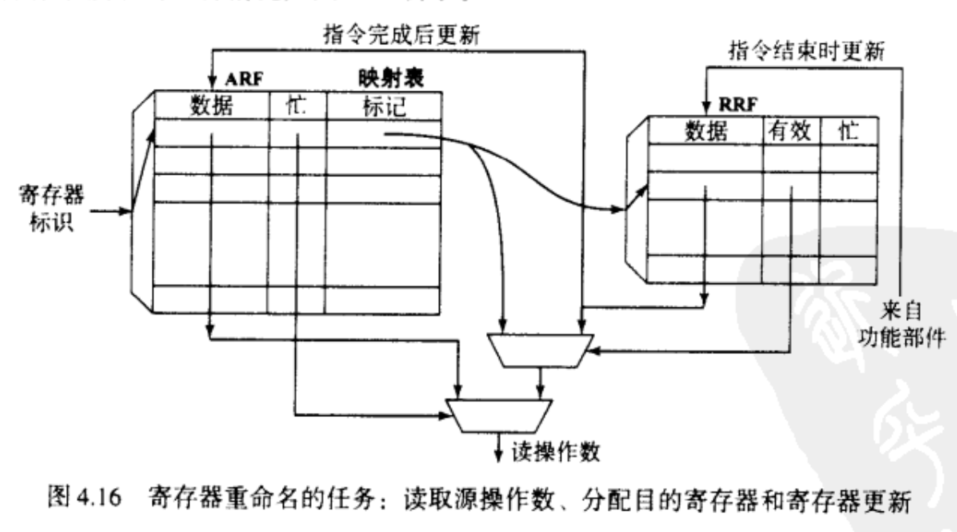

---
title: SuperScalar CPU Design
author: JYC
description: Note about <<超标量处理器设计>>
date: 2024-4-8 19:12:30 
categories: [Digital Circuit, Notes about book]
tags: [CPU, SuperScalar]     # TAG names should always be lowercase
--- 

# 寄存器重命名技术

## 概述

一个程序的指令间存在许多的相关性，所谓相关性，是指一条指令依赖另一条指令，从行为上看是指令间的源操作寄存器和目的寄存器相同，一般的数据相关性包含以下三种： 

-  WAW （Write After Write）相关性，两条指令的目的寄存器相同
-  WAR  (Write After Read) 相关性，表示前一条指令的源寄存器与后一条指令的目的寄存器相同
-  RAW  (Read After Write) 相关性，表示前一条指令的目的寄存器与后一条指令的源寄存器相同

相关性又分为假相关和真相关，假相关可以看出只是寄存器的名称相同，但并没有真的依赖关系， WAW 和 WAR 就是典型的假相关，而RAW则是真相关，因为前一个指令的结果真正影响着后一条指令。一个很明显解决假相关问题的方法就是增加寄存器的数量(见下图)，这样就不会有名称的重复，但是对于一个指令集，增加寄存器的数量会导致对以前程序的不兼容，所以提出了寄存器重命名技术，在硬件层面上增加物理寄存器，不增加逻辑寄存器的数量，并通过寄存器重命名技术来实现物理寄存器和逻辑寄存器的映射。

- 物理寄存器指CPU中实际有的寄存器
- 逻辑寄存器指指令中存在的寄存器

## 如何实现寄存器重命名

寄存器重命名的任务：读取源操作寄存器、分配目的寄存器和寄存器更新。具体操作如下图，首先通过逻辑寄存器（Arithmetic Register File ,ARF）进行索引物理寄存器（Physical Register File, PRF）索引，然后再通过PRF索引得到真正的寄存器值

在寄存器重命名中主要运用了重命名映射表，这个表格在具体实现上有两种方式，一种是基于SRAM(SRAM-Based RAT,sRAT)，二是基于CAM（）