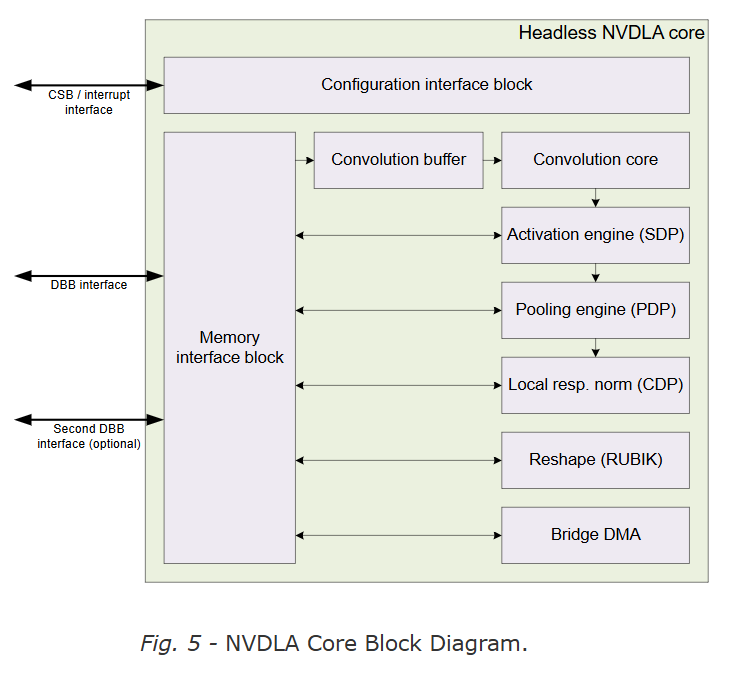

---
title: NVDLA架构分析
author: JYC
description: 
date: 2025-4-19 19:12:30 
categories: [Digital Circuit,AI芯片]
tags: [NVDLA,NPU]     # TAG names should always be lowercase
--- 

NVDLA(NVIDIA Deep Learning Accelerator)是一种可配置的硬件神经网络加速器，他通过独立的模块加速各个CNN网络的各个层，且这些模块相互独立可以分开从而有着更好的灵活性。其基础架构图如下所示，对于其中模块进行主要介绍，首先是对于四种接口的介绍

- CSB(Configuration Space Bus,CSB)，这是一种简单的低性能总线主要用于主系统对于NVDLA做一些像**配置寄存器**这样简单的任务。
- IQR(External interrupt) 这个接口主要向主系统进行NVDLA状态的汇报，通过其可以知道NVDLA内部的状态，如发生异常、操作完成等
- DBB(Data BackBone) NVDLA有着自己的DMA系统来访问系统内部内存，从而达到直接搬移数据的操作，其主要是AMBA AXI-4这种高性能总线。
- SRAMIF(SRAM Connection) 有一些系统有着对于高吞吐量，低延迟的要求或者希望使用小的SRAM作为Cache，这时像DRAM这种高延迟的存储器显然已经不符合要求，所以有着第二条DBB用于访问SRAM，以提高NVDLA的性能满足系统的要求

然后是对于各个子模块的简单介绍，为了支持加速CNN推理中的各个层并将其解耦，NVDLA主要将其分为5个group，每个group对应于CNN推理中的一个操作。

- 卷积操作(Convolution core和 Convolution buffer)
- 单数据定点操作(Activation engine block)
- 平面数据操作(Pooling engine block)
- 多平面操作(Local resp. norm)
- 数据存储和Reshape操作(Reshape and Bridge DMA blocks)

